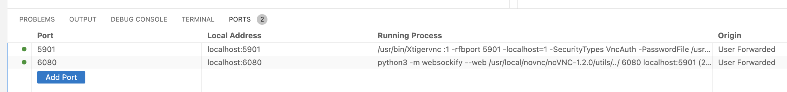
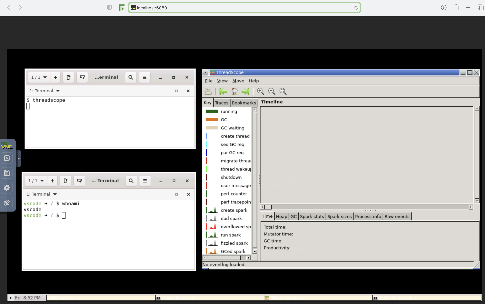

# readme

Haskell anywhere. This repository demonstrates how to run your vscode-based haskell development environment in a devcontainer.

## prerequisites:

* vscode
* docker
* optionally: ssh keys for github integration 
  
  Git is installed by default, but to use it with e.g. github, you need to have your ssh keys available in the devcontainer (if ssh is the authentication method you're using). For the sake of simplicity, ssh keys are the preferred authentication method endorsed by this repository. [Here](https://code.visualstudio.com/docs/devcontainers/containers#_using-ssh-keys) is how to share your physical machine's ssh keys with your devcontainer. Simply run a command like this (depending on the names of your keys) from your physical machine and restart your devcontainer if you have it running:

  ```bash
  ssh-add $HOME/.ssh/id_rsa
  ```

  Also don't forget about your name and email if you're not using a global setting. Run this from your running devcontainer:

  ```bash
  git config user.name "Your Name"
  git config user.email "your.email@address"
  ```
* threadscope is a gui tool which cannot be launched from the vs code terminal, so in order to use it:
  * configure vs code to forward ports:
    * 5901
    * 6080

    
  * now you can open it from your host operating system's browser under http://localhost:6080

  
  * [source](https://technology.amis.nl/software-development/run-and-access-gui-inside-vs-code-devcontainers/)

## features

* ghcup
  * configurable version of ghc
  * configurable version of cabal
  * stack
  * hls
* tasks.json - build the code using familiar shortcuts
* threadscope - a tool for visualising the execution of haskell programs (suggestion from [Parallel and Concurrent Programming in Haskell](https://www.oreilly.com/library/view/parallel-and-concurrent/9781449335939/)